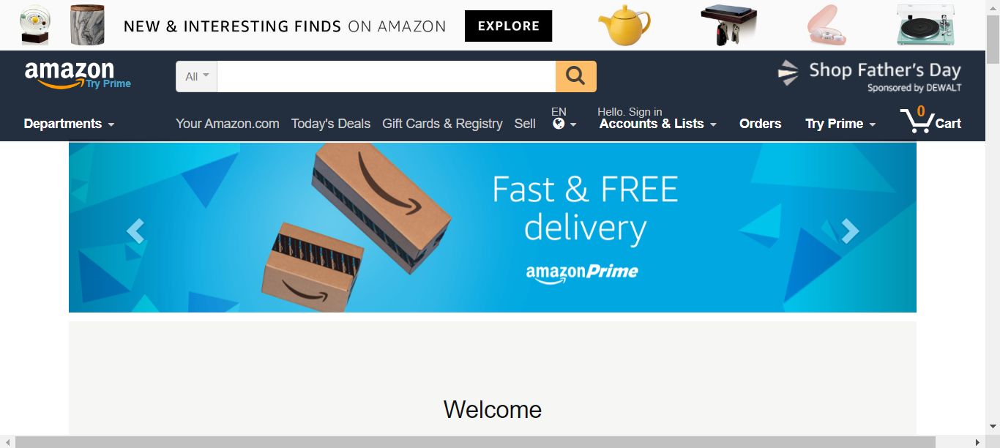

# AMAZON BASICO
☑️SITE SEMELHANTE A AMAZON (APENAS O FRONT-END).

 <br>

## DESCRIÇÃO:
É a estrutura de uma página da web que simula a interface do usuário do site da Amazon. O aplicativo resultante seria um site de comércio eletrônico onde os usuários podem navegar por diferentes departamentos, visualizar produtos em destaque, realizar pesquisas, adicionar itens ao carrinho e acessar informações úteis sobre a Amazon, como conta do usuário, pedidos recentes e ajuda. Basicamente, o aplicativo seria uma versão simplificada do site oficial da Amazon, permitindo aos usuários explorar produtos e serviços oferecidos pela empresa.

## COMO USAR?
* Clone o repositório para o seu sistema local:

```bash
git clone https://github.com/VILHALVA/AMAZON-BASICO.git
```

* Navegue até o diretório do projeto.

```bash
cd AMAZON-BASICO
```

* Descompacte o arquivo ZIP (se você baixou manualmente):

```bash
unzip AMAZON-BASICO.zip
```
* Abra o arquivo `CODIGO.html` em seu navegador de preferência.

## NÃO SABE?
- Entendemos que para manipular arquivos em `HTML`, `CSS` e outras linguagens relacionadas, é necessário possuir conhecimento nessas áreas. Para auxiliar nesse aprendizado, oferecemos cursos gratuitos disponíveis:
* [Curso de HTML e CSS](https://github.com/VILHALVA/CURSO-DE-HTML-E-CSS)
* [Curso de JavaScript](https://github.com/VILHALVA/CURSO-DE-JAVASCRIPT)
* [Confira mais cursos](https://github.com/VILHALVA?tab=repositories&q=+topic:CURSO)

## CREDITOS:
- [PROJETO CRIADO PELO "Ironhack-Archive"](https://github.com/Ironhack-Archive/online-clone-amazon)
- [PROJETO EDITADO PELO VILHALVA](https://github.com/VILHALVA)
- [ESTÁ DISPONIVEL NO SITE](https://vilhalva.github.io/STYLER/STYLER.html)